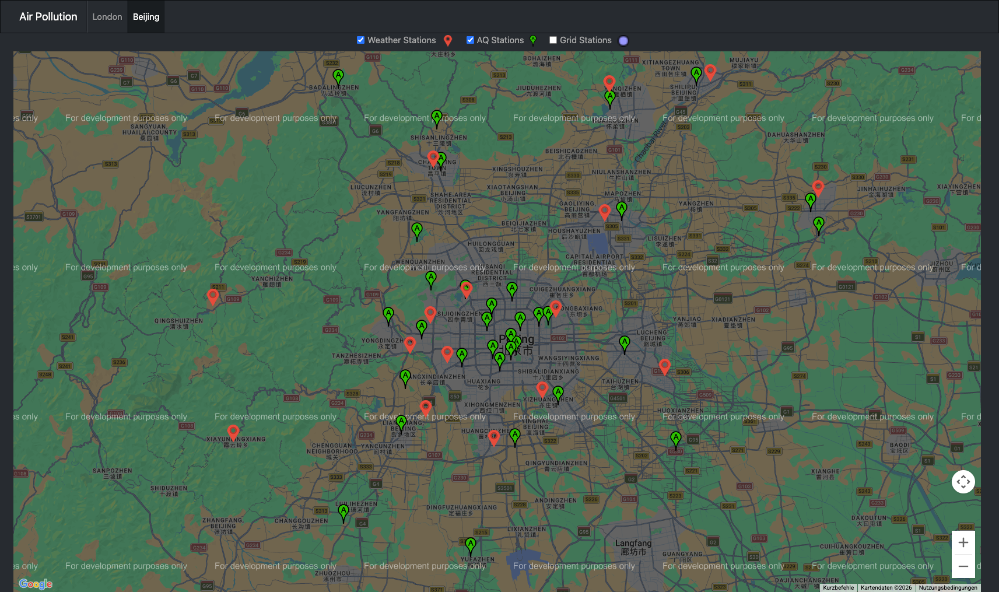
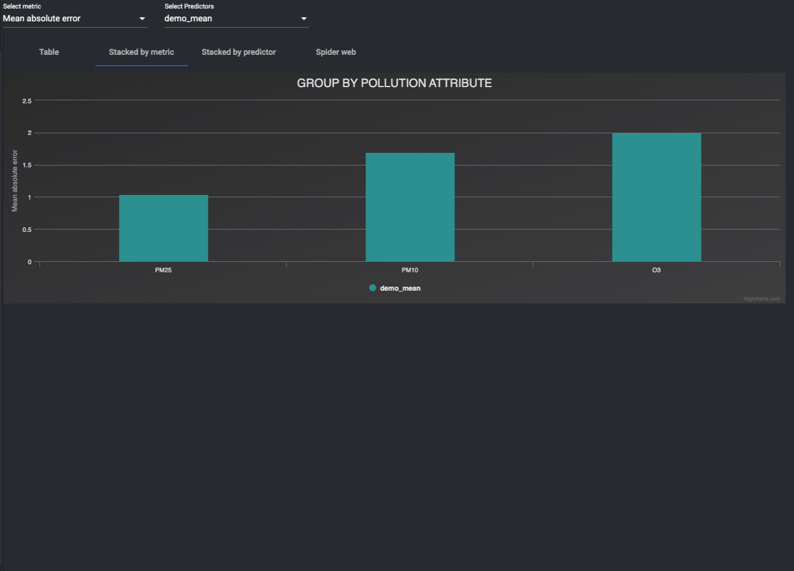

# Air Quality Prediction Platform

Full-stack university project for exploring, visualizing, and predicting urban air-quality measurements. The platform combines an Angular dashboard, a Python/Falcon API, MongoDB-backed repositories, data import scripts, preprocessing workflows, model evaluation metrics, and trained predictor artifacts.

This repository is being prepared as a portfolio-safe version of the original Air Pollution project. Legacy deployment credentials and private infrastructure files have been removed.

## Demo Preview

The dashboard provides map-based station exploration, historical air-quality and weather charts, and predictor evaluation views from the same local full-stack environment.






## Portfolio Positioning

This project demonstrates end-to-end engineering across a data-driven web platform:

- Angular/TypeScript dashboard for stations, maps, weather, pollution charts, and predictor comparisons.
- Python Falcon API for station, weather, air-quality, prediction, and metric endpoints.
- MongoDB persistence layer with repository-style data access.
- Data import and preprocessing scripts for historical air-quality and weather datasets.
- Machine-learning predictor implementations and stored trained model artifacts.
- Docker-based local development setup and GitLab CI build/test pipeline.

## Tech Stack

- Frontend: Angular 6, TypeScript, Angular Material, Bootstrap, Highcharts, Chart.js, Google Maps integration.
- Backend/API: Python 3.6, Falcon, Waitress, Falcon CORS.
- Data/ML: pandas, NumPy, SciPy, scikit-learn, TensorFlow, Keras, HDF5/Tables.
- Database: MongoDB.
- Delivery: Docker Compose, Dockerfiles, GitLab CI.

## Repository Structure

```text
airPollution/   Angular dashboard
server/         Python API, CLI, preprocessing, models, and resources
dbServer/       Local MongoDB development placeholder
docker_data/    Ignored local MongoDB runtime data placeholder
scripts/        Import helper scripts for Unix and Windows
deployment/     Sanitized legacy deployment placeholder
```

## Documentation

- [Architecture](docs/architecture.md): system overview, frontend/API/data flow, prediction pipeline, runtime notes, and verification strategy.
- [Public release checklist](docs/public-release-checklist.md): safety, ownership, secret, verification, and repository-readiness checks before making the repo public.
- [Demo and screenshot plan](docs/demo-plan.md): recommended screenshots, README placement, and demo verification checklist.

## Local Development

The original stack targets older runtimes: Node 8/Angular 6 and Python 3.6. For best results, use Docker or matching legacy runtimes.

Start the local services:

```bash
docker compose up --build
```

Older Docker Compose installations can use:

```bash
docker-compose up --build
```

The Compose file pins legacy services to `linux/amd64` so the stack can run on Apple Silicon through Docker emulation.

Expected local ports:

- Frontend: `http://localhost:4200`
- API: `http://localhost:8080`
- API docs container: `http://localhost:8081`
- MongoDB: `localhost:27017`

The API container uses these environment variables:

```text
DB_URI=mongodb://mongodb:27017
DB_NAME=air-pollution
PORT=8080
```

## Frontend Commands

```bash
cd airPollution
npm install
npm run build
npm test
```

## Backend Commands

```bash
cd server
pipenv install --skip-lock
pipenv run ./www
```

For local non-Docker use, create `server/air_pollution/config/mongodb_config.py` from `server/air_pollution/config/mongodb_config.example.py`.

## Verification

This portfolio copy includes a lightweight GitHub Actions workflow that compiles the backend source tree and runs dependency-light backend unit tests.

```bash
python -m compileall -q server/air_pollution
PYTHONPATH=server python -m unittest discover -s server/tests -v
```

The Angular application targets an older Node/Angular stack, so frontend build verification should be run with Docker or a matching Node 8 environment.

## Data And Model Artifacts

The repository includes historical data samples and trained predictor files. Large model/data artifacts are configured for Git LFS via `.gitattributes`.

## Public-Release Safety Notes

Before publishing publicly:

- Confirm this university project is safe to publish.
- Keep deployment credentials, private keys, runner tokens, production hostnames, and private server details out of the repository.
- Rotate any credentials that existed in the historical source archive.
- Do not publish private company, client, or employer-owned code.

## Portfolio Summary

Air Quality Prediction Platform is a full-stack data application that visualizes city air-quality and weather measurements, serves prediction data through a Python API, and includes preprocessing plus machine-learning workflows for evaluating forecast models.
